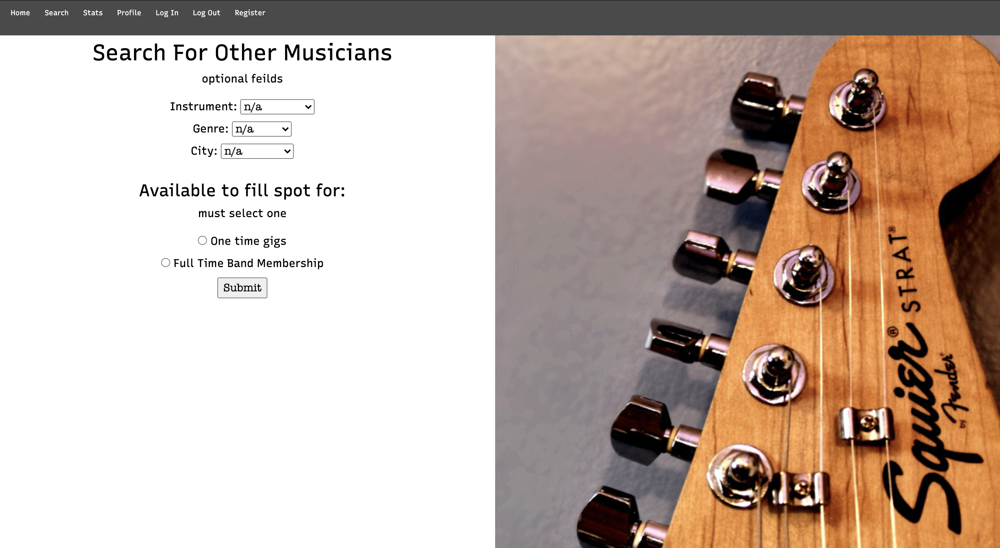
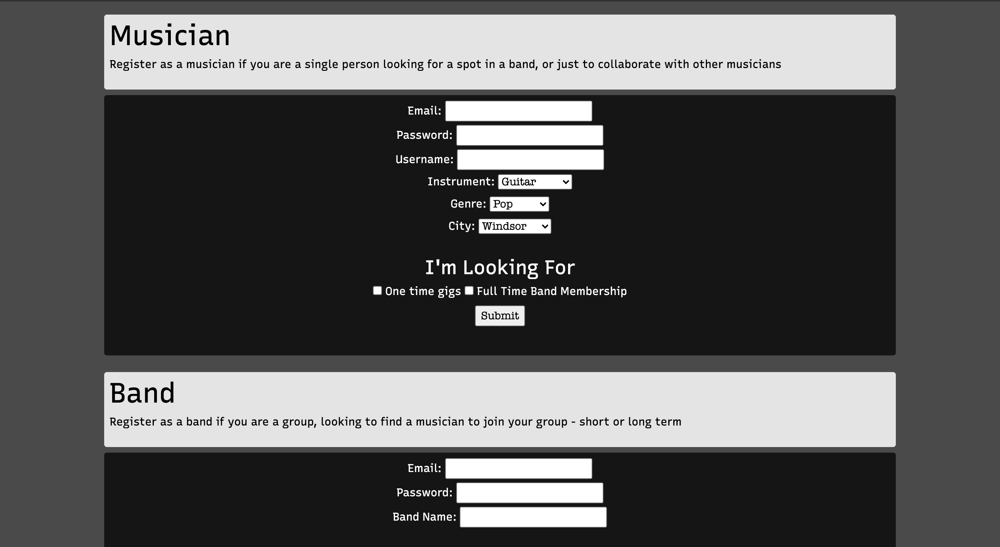

# Ensable
*a websites that helps bands who are in need of new members find musicians who fit their criteria*

link to live site: http://ransomm.myweb.cs.uwindsor.ca/60334/ensamble/html/index.html

This website was created as a final project in my first serious web development course
I utlized my new more advaned knowledge with Databases, MySql, php, Javascript and Bootstrap to create a fully flushed out site.
From conception to final product, this was my first project of this scale.

My original UI design was much more ambitious and clean (originally designed in XD), but was modified as I came across inevitable first timer roadblocks where I had to adapt (as I implimented).
These misteps were critical in aiding me learn how front end designs are layed out vs how they are built, and how the two aspects come together. 

You can search the site to find musicians who fit certain critera.

You can sign up as a solo musician or band. Bands post ads that notify musicians who meet the criteria they are looking for. 

There is no SEO due simply to scope, time constraints, and skill level but a serious reiteration could include results ranked on importance/relativity.
The categories are narrowed down to a small list drop down boxes mostly for proof of concept reasons.
A small condenced user base could benifit from this, but a more diverse user base would more likely benifit for more options.

Inspiration comes from my roots in the musical community.  Many freelance preformers use sites like Fiver and Craigs list to enlist new members, or find one time gigs.
I thought creating a decicataed space for this community to collaborate with a streamlined experience would fill a need to aid fellow musicians connect with each other.

